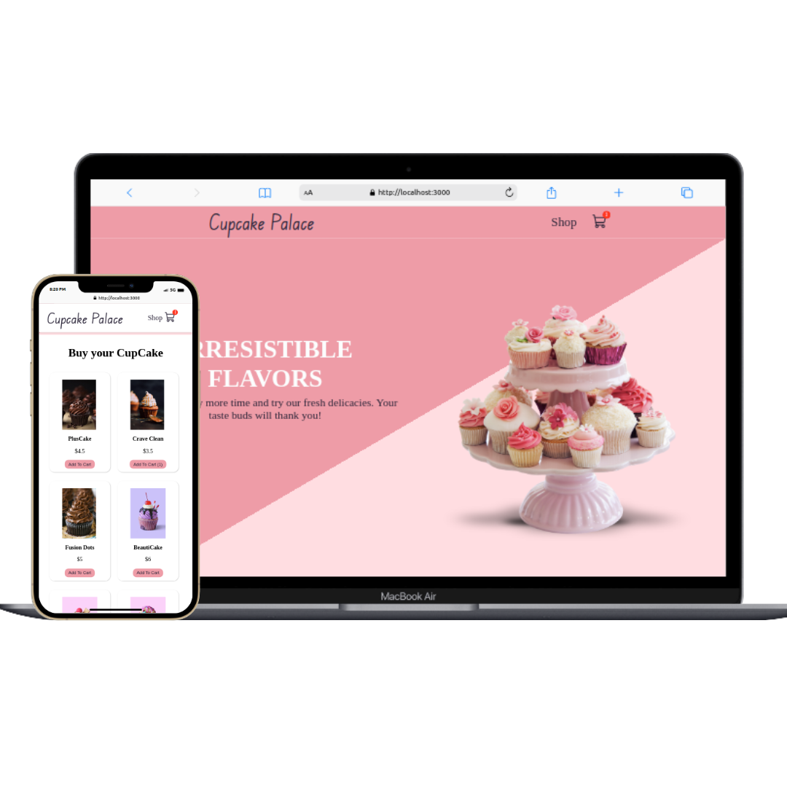

# Cupcake Palace

  

This project is an e-commerce simulation of a cupcake store developed using JavaScript, ReactJS, and CSS. The website includes a navigation bar, home page, shopping page, and cart with prices.

## Technologies Used

- React
- JavaScript
- CSS

## How to Run

1. Make sure you have Node.js installed on your system.
2. Clone this repository using the following command: git clone https://github.com/Aleikson/ExampleOfEcommerce.git
3. Navigate to the project directory:
4. Install the project dependencies:
5. Start the development server:
6. Open your browser and access the following URL: http://localhost:3000

## Contact

Aleikson - [aleiksonsilva@hotmail.com](mailto:aleiksonsilva@hotmail.com)
